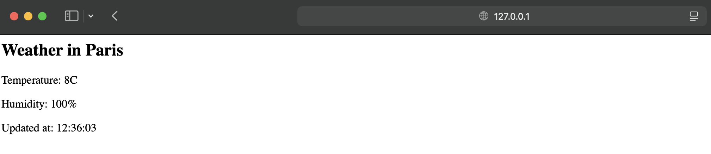

# DevOps Практическое задание №2 
## Текст задания
Написать bash-скрипт, который принимает в качестве входящего параметра город, выводит температуру и влажность в текущий день в этом городе
## Демонстрация
